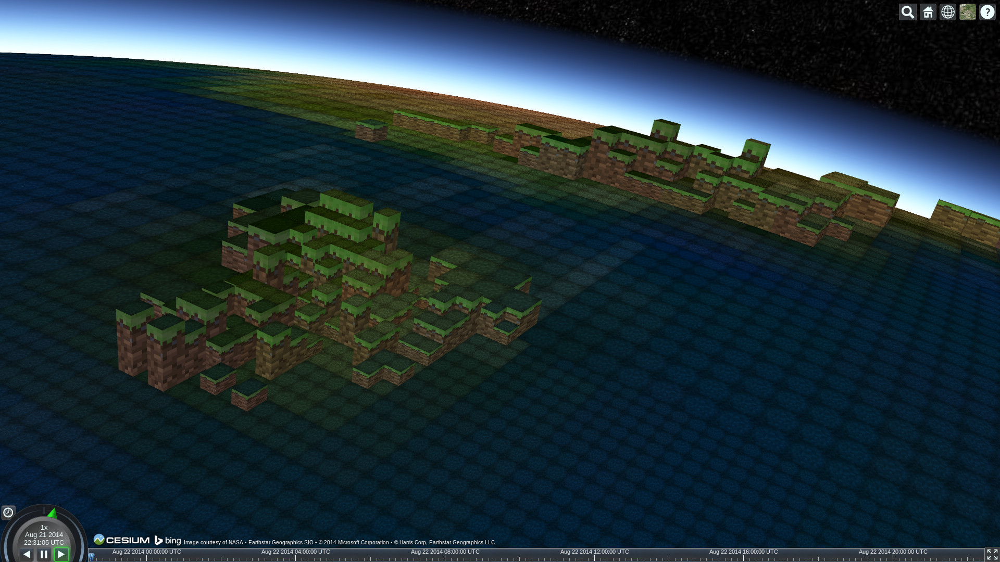

 

cesium-blockworld
=================

A toy [Cesium](http://cesiumjs.org) example app that renders the world in voxels.  Check out the [live demo](http://nicta.github.io/cesium-blockworld). This example uses Cesium's quadtree primitive to dynamically generate arbitrary geometry per tile.

